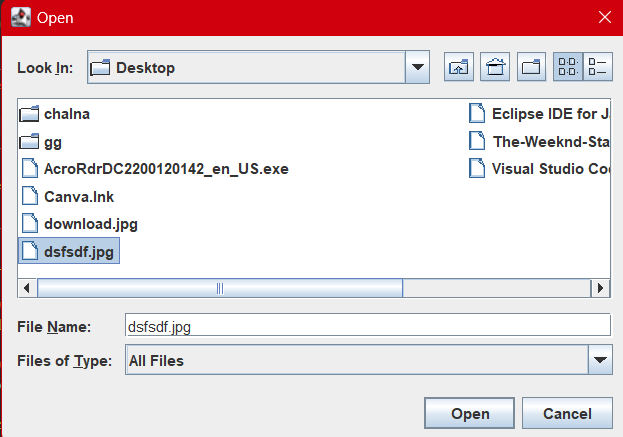

# IMAGE VIEWER

## Introduction
Image viewer application with a user-friendly graphical interface to facilitate seamless browsing and organization of image files. The application should enable users to effortlessly view images.

## Usage
1. User-Friendly Interface: Design an intuitive interface that allows users to navigate through their image collections effortlessly.
2. Responsive Design: Ensure the application's interface is responsive and adaptable to different screen sizes and resolutions for optimal user experience across various devices.

## Example

## TECH STACK
1. JAVA
2. SWING

## How it Works

Upon launching the application, users are presented with a user-friendly interface that displays thumbnails or a list of available image files.
The UI may include navigation controls such as buttons, sliders, or gestures to facilitate browsing through images.
Image Selection:

Users can select an image file either by clicking on its thumbnail or by navigating through the list of images using provided controls.
Once an image is selected, it is loaded into the viewer for display.
Image Viewing:

The selected image is displayed within the application's viewer window at an appropriate size.

## Contribution
Contributions are welcome! Feel free to submit issues or pull requests.

