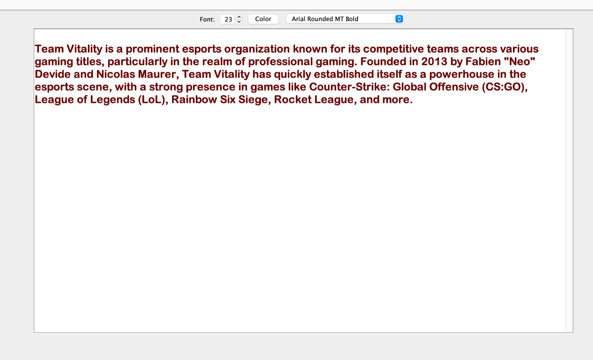

# Basic Text Editor

## Introduction
The Java Text Editor is a versatile application designed to facilitate text editing tasks for users. It boasts a user-friendly graphical interface and essential functionalities for creating, editing, and saving text documents. Additionally, the application allows users to edit multiple text files simultaneously and provides features for formatting text, including color, font, and size adjustments.

## Usage
1. Opening and Creating Text Files.
2.  Editing Text.
3.  Formatting Text.
4.  Saving Files.

## Sample


## Getting Started
To run the project locally, follow these steps:

1. Clone the repository.
2. Navigate to the project directory.
3. ``` bash
   compile using this command ->  javac basic.java
    run using this commad -> java basic.java

   

## Dependencies
- open jdk must be installed on your device


## Contribution
Contributions are welcome! Feel free to submit issues or pull requests.