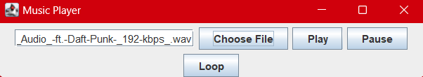

# MUSIC PLAYER

## Introduction
The application should offer users a comprehensive and intuitive interface for managing and enjoying their music, incorporating innovative features to enhance the listening experience.

## Usage
Upon launching the application, users are presented with a user-friendly interface that displays thumbnails or a list of available image files.
The UI may include navigation controls such as buttons, PLAY, PAUSE, RESUME, LOOP.

## Example

## Dependencies
1. JAVA
2. AWAIT

## How it Works
1. Users can select a song from their library to play by browsing through their music collection or searching for specific tracks.
Once a song is selected, the application initiates playback, and the audio is streamed or played directly from the device's storage.
2. The application provides standard playback controls such as play, pause, stop, loop. 

## Contribution
Contributions are welcome! Feel free to submit issues or pull requests.

